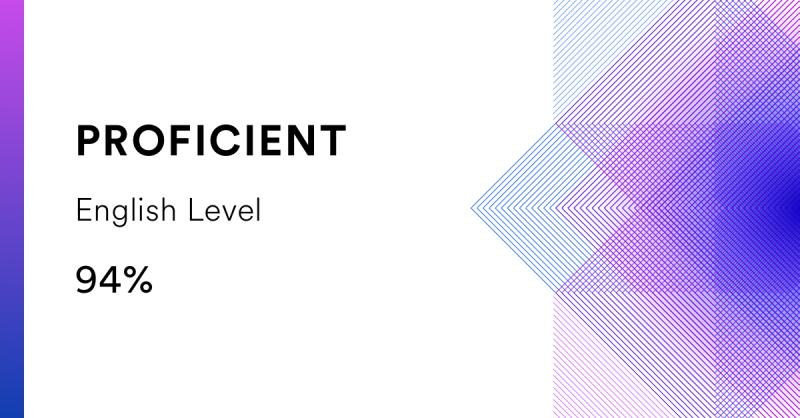

# Anna Silinskaya

---

## Contacts
* **Email**: annsilin@mail.ru
* **GitHub**: [annsilin](https://github.com/annsilin)
* [LinkedIn](https://www.linkedin.com/in/anna-silinskaya/)
* **Discord**: annsilin

---

## About me
Currently, I'm a 5th year student at Saratov State University. 
I'm mostly interested in Python and JavaScript and wish to become a FrontEnd developer. I don't have work experience yet,
but I do have some uni projects written in Python, Django and JavaScript, unfortunately I can't share the code publicly as of now.

My personal strengths:
* Responsibility
* Dedication
* Logical thinking
* Determination

---

## Skills
* C++, C#
* Python
* HTML, CSS/SASS
* JavaScript (basic)
* Git, GitHub, GitLab
* MS SQL Server, SQLite
* Adobe Photoshop

---

## Code Example
[ReversedStrings](https://www.codewars.com/kata/5168bb5dfe9a00b126000018/train/javascript) task from Codewars:
```javascript
function solution(str){
  return str.split("").reverse().join("");
}
```

---

## Education
* **Saratov State University named after N.G. Chernyshevsky**\
Computer Science and Information Technology faculty\
Department of Mathematical Cybernetics and Computer Science\
2019 - 2024, Bachelor's Degree

* [CS50's Web Programming with Python and JavaScript](https://cs50.harvard.edu/web/2020/) (in progress)
* [RS School's JavaScript/Front-end. Stage 0](https://rs.school/js-stage0/) (in progress)

## Languages
* Russian - Native
* English - Upper Intermediate/Advanced (according to the [EF SET](https://www.efset.org/quick-check) online test)


---

## Achievements

In [2019's Hackathon "Ottepel"](https://www.saratovit.ru/2019/04/24/hakaton-ottepel-vpechatleniya-pobeditelej-i-plany-na-budushhee/) I was a part of the team named 'Ballast' and we took a 2nd place in the
nomination «Data Analysis» for «Cosmetics Ingredients Analysis
Service» project. We tried to solve OCR task on difficult use cases such as distorted surfaces with
existing deep learning solutions. 